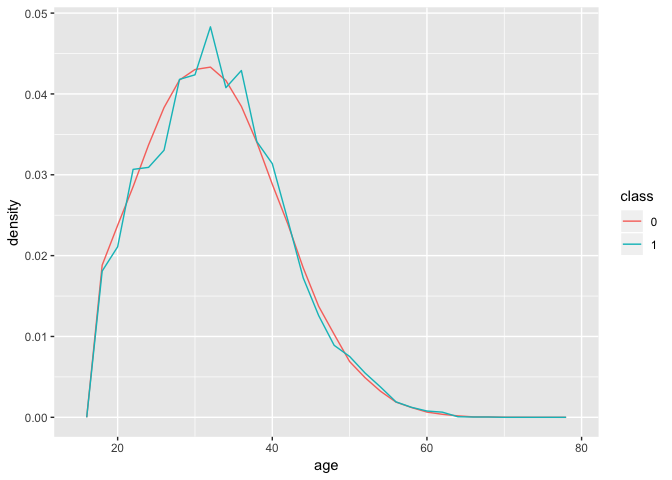
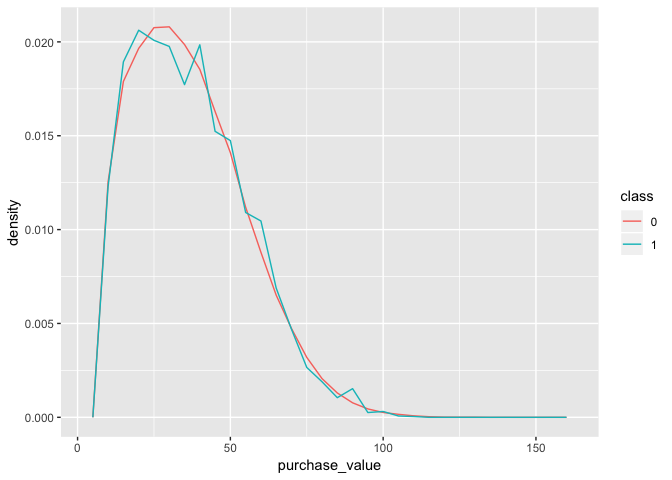
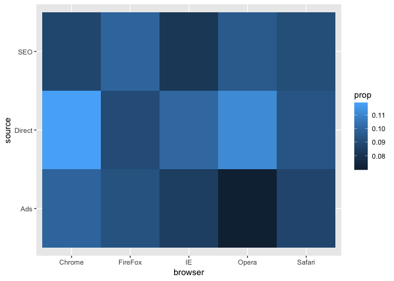

    library(readr)
    library(tidyverse)

    ## -- Attaching packages ----------------------------------------------- tidyverse 1.2.1 --

    ## <U+221A> ggplot2 3.0.0     <U+221A> purrr   0.2.5
    ## <U+221A> tibble  1.4.2     <U+221A> dplyr   0.7.6
    ## <U+221A> tidyr   0.8.1     <U+221A> stringr 1.3.1
    ## <U+221A> ggplot2 3.0.0     <U+221A> forcats 0.3.0

    ## -- Conflicts -------------------------------------------------- tidyverse_conflicts() --
    ## x dplyr::filter() masks stats::filter()
    ## x dplyr::lag()    masks stats::lag()

### Age vs Fraud

The graph below reveals the relationship between age and proportion of
fraud. The red represents non-fraud purchase whereas the green line
represents the fraud data. As shown in the graph, the two curves are
relatively close to each other and amlost indistinguishable for most
part. Thus age is not a good indicator.

    data1%>%
      ggplot(data1,mapping=aes(x=age,y=..density..,color=class))+
      geom_freqpoly()

    ## `stat_bin()` using `bins = 30`. Pick better value with `binwidth`.

### Purchase value vs Fraud

The graph below shows the relationship between purchase value of
proportion of fraud, as shown in the graph the two curves are really
close to each other, thus it could not be used as an indicator.

    ggplot(data1)+
      geom_freqpoly(mapping = aes(x=purchase_value,y=..density..,color=class))

    ## `stat_bin()` using `bins = 30`. Pick better value with `binwidth`.

    a<-data1%>%
      mutate(time=purchase_time-signup_time)%>%
      ggplot()+
      geom_freqpoly(mapping = aes(x=time,y=..density..,color=class))

### IP address vs Fraud

The IP address can be used as an indicator of users' locations. By first
filtered out all the invalid ip address, we could match all the
remainded ip address with certain country and calculted the proportion
of fraud data. The table below shows the country and users proportion of
fraud. Because we are using this as an indicator for fraud, I filtered
out countries with user number smaller than 100. Since it is reasonable
to assume data set smaller than 100 might have strong biase.

    library(IPtoCountry)

    data1%>%
      filter (ip_address >= 16777216, ip_address<=3758096383)%>%
      mutate(country=IP_lookup(ip_address))%>%
      group_by(country)%>%
      summarize(prop=sum(num)/n(),number=n())%>%
      filter(number>=100, prop>=0.1)%>%
      arrange(desc(prop))

    ## # A tibble: 26 x 3
    ##    country       prop number
    ##    <chr>        <dbl>  <int>
    ##  1 Tunisia      0.263    118
    ##  2 Peru         0.258    120
    ##  3 Ecuador      0.257    109
    ##  4 New Zealand  0.226    279
    ##  5 Croatia      0.183    104
    ##  6 Lithuania    0.175    120
    ##  7 Hong Kong    0.165    514
    ##  8 Ireland      0.164    360
    ##  9 Chile        0.156    416
    ## 10 Saudi Arabia 0.152    349
    ## # ... with 16 more rows

### Purchase source vs fraud

The Direct source users have slightly higher proportion of fraud than
the other two, but the difference is relatively indistinguishble.

    data1 %>%
      group_by(source)%>%
      summarise(sum(num)/n())

    ## # A tibble: 3 x 2
    ##   source `sum(num)/n()`
    ##   <chr>           <dbl>
    ## 1 Ads            0.0921
    ## 2 Direct         0.105 
    ## 3 SEO            0.0893

The 5 types of browsers has relatively similar proportion of fraud for
their users, with Chrome and FireFox being the highest two proportions
over 0.095, and IE and Opera being the lowest ones which have proportion
lower than 0.090

    data1 %>%
      group_by(browser)%>%
      summarise(sum(num)/n())

    ## # A tibble: 5 x 2
    ##   browser `sum(num)/n()`
    ##   <chr>            <dbl>
    ## 1 Chrome          0.0988
    ## 2 FireFox         0.0952
    ## 3 IE              0.0868
    ## 4 Opera           0.0892
    ## 5 Safari          0.0902

There's no obvious correlation between fraud and gender. The proportion
is 0.091 for female and 0.096 for male. thus this could not be used as
an indicator.

    data1 %>%
      group_by(sex)%>%
      summarise(sum(num)/n())

    ## # A tibble: 2 x 2
    ##   sex   `sum(num)/n()`
    ##   <chr>          <dbl>
    ## 1 F             0.0910
    ## 2 M             0.0955

There's no obvious correlation between fraud source and used website.
The gradual change of color represents the proportion of fraud, thus
lighter ones represents higher proportion of fraud. But the graph shows
a pretty random distribution of color, thus there's no clear
correlation.

    data1%>%
      group_by(browser,source)%>%
      mutate(prop=sum(num)/n())%>%
      ggplot(mapping = aes(x=browser,y=source)) + 
      geom_tile(mapping = aes(fill=prop))

The following table represents the frequency and number of fraud per
each device id which have been frauded for at least 5 times. So if the
fowllowing device, especially the ones that has fraud proportion =1.0,
then the stores can immediately say that this device is frauding.

    data1%>%
      group_by(device_id)%>%
      summarise(number_of_fraud=sum(num),prop=sum(num)/n())%>%
      filter(number_of_fraud>5)%>%
      arrange(desc(prop))

    ## # A tibble: 711 x 3
    ##    device_id     number_of_fraud  prop
    ##    <chr>                   <int> <dbl>
    ##  1 BQFVIFYBACRXO              12     1
    ##  2 EPILONTXYYWPF              14     1
    ##  3 GWTUHKHQXIXDI               9     1
    ##  4 HHSLZRTYDORAZ              12     1
    ##  5 HVWLAYPAUUDDP              13     1
    ##  6 IOVPBTEAMIPSI              13     1
    ##  7 JNKJQBMHCUZDB               9     1
    ##  8 LQOVYJCFDDWKF              14     1
    ##  9 MQGEVZIVNVZFL              11     1
    ## 10 NEDQGMKXTGBFF              11     1
    ## # ... with 701 more rows
