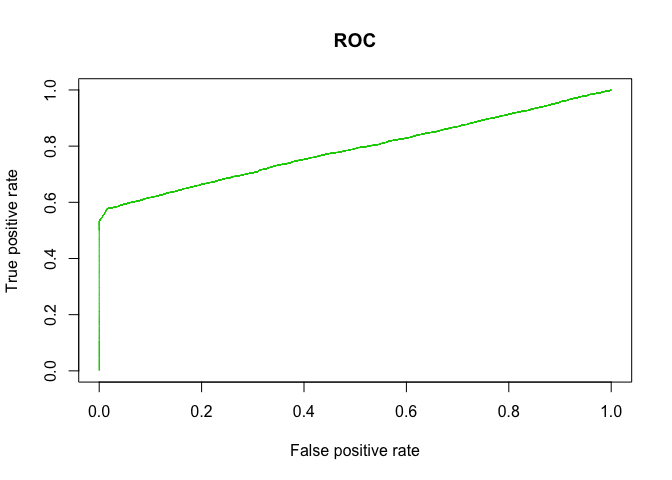

## Data cleaning
We start off the project by cleaning data set and creating new features. The newly created variable "time" measures the difference in time between the purchase time and the sign up time provided in the original data set 

### Training data set 
In this section we eliminating meaningless features first. For example, the user id, which I realized there's no repeated user id, thus we can eliminate the column from the fraud data.

```
## # A tibble: 151,112 x 2
##    user_id     n
##      <int> <int>
##  1       2     1
##  2       4     1
##  3       8     1
##  4       9     1
##  5      12     1
##  6      16     1
##  7      18     1
##  8      26     1
##  9      33     1
## 10      39     1
## # ... with 151,102 more rows
```


Since the data is an unbalanced data set with over 90% fraud data and less that 10% not fraud data, we use the createDataPartition function to generate test and train data set to fairly represent the class in order to avoid bias in data splitting


Generating new feature that counts the times of repeated device id. Because in the previous time exploring the data set, we found that the number of time a device id has been used is helpful for predicting fraud/non-fraud data. Then we merge the counts back to the original training data set


Generating new feature that counts the times of a repeated ip address. Following the same steps as mentioned just above.


Deleting columns of ip-address and device id from original data set 


Changing sex into a 0/1 factor column for easier processing later


Creating Dummy variables for both browser and source. Because both of them only has few levels, thus creating dummy variables helps for building a predicting model meanwhile doesn't increase the calculation by too much. Then we delete the original columns, browser and source from the data set  


### cleaning for testing 
We repeat the exactly same procedure for the testing data set. The reason why we did it separately was by doing so, we did not use additional information for building the model. 


## Random Forest
In this section we use the Random forest model for prediction. We used the training data set and testing data set generated from the data partition method mentioned in the second above. By using the random forest method, we obtained a Kappa value of *** and a small 


This section we built a model using random forest and the training data set.


Since the model takes a long time to run, we saved it as a rds file and read it every time when we need


Predicting the class using the random forest model built above with the testing data set

```
##           
## testforest     0     1
##          0 34185  1643
##          1    37  1913
```
This table shows the corresponding predicted value and actual value, 0 means not fraud and 1 means fraud. Horizontal is the actual value and the vertical is the predicted values.


```
## Confusion Matrix and Statistics
## 
##           Reference
## Prediction     0     1
##          0 34185  1643
##          1    37  1913
##                                           
##                Accuracy : 0.9555          
##                  95% CI : (0.9534, 0.9576)
##     No Information Rate : 0.9059          
##     P-Value [Acc > NIR] : < 2.2e-16       
##                                           
##                   Kappa : 0.6731          
##  Mcnemar's Test P-Value : < 2.2e-16       
##                                           
##             Sensitivity : 0.9989          
##             Specificity : 0.5380          
##          Pos Pred Value : 0.9541          
##          Neg Pred Value : 0.9810          
##              Prevalence : 0.9059          
##          Detection Rate : 0.9049          
##    Detection Prevalence : 0.9484          
##       Balanced Accuracy : 0.7684          
##                                           
##        'Positive' Class : 0               
## 
```
The confusion matrix tells the statistics information about the random forest model. The Kappa value is 0.6729 which means the model is better than a random guessing model which has a kappa value of 0.5. Small p-value proves the model is statistically significant. High sensitivity indicates we are good at predicting true positive rate which means that all of actual fraud (positives) have been correctly identified. 0.5380 specificity(also called the true negative rate) means that the test is almost equivalent for not fraud individuals to a random draw

<!-- -->

```
##                          0           1 MeanDecreaseAccuracy
## purchase_value  -0.7039158  -0.1683782           -0.7389691
## sex             -0.2179776   6.0249583            1.3202179
## age             -0.3307142  -1.1869018           -0.6389973
## time            36.7191253 862.1205836           92.3397620
## id_n            50.1001947  10.4149881           29.7642281
## ip_n            16.8444781  12.3591207           12.9778002
## browserChrome  -12.9000634   5.0705307          -12.0612774
## browserFireFox -15.1512398   8.0387957          -12.4946873
## browserIE      -14.2952729   6.1112845          -12.5559790
## browserOpera   -17.5556896   2.4703079          -16.5782781
## browserSafari  -14.6648216   5.1941586          -12.8222628
## sourceAds        5.0556486  -0.8064903            4.9686764
## sourceDirect     5.2880307  18.6004758           11.0151495
## sourceSEO        5.0291635   0.8034029            5.3364372
##                MeanDecreaseGini
## purchase_value       1683.30498
## sex                   279.02130
## age                  1406.07529
## time                11378.09041
## id_n                 1188.27143
## ip_n                 2159.58986
## browserChrome         170.26291
## browserFireFox        139.77085
## browserIE             156.26383
## browserOpera           50.62404
## browserSafari         134.83250
## sourceAds             136.61295
## sourceDirect           84.69111
## sourceSEO             131.11020
```
Here are the two tables that show the significant features in this model, we see that time is definitely the most important one, followed by number of repeated ip address,  purchase value , repeated times of same id and age, the other features are not as useful in this model as the ones mentioned above. 

<!-- -->

```
## [1] 0.7859087
```
Drawing a ROC curve to evaluate the model. The green line represents the random forest model which is definitely above the diagonal line of random guessing model. The Area under the curve is about 0.78 with 1 being the best model and 0.5 being the random guessing model, which confirms that the model is actually not bad.


## Recursive Partitioning And Regression Trees

In this section, we made a classification model using the rpart function. 


```
## 
## Classification tree:
## rpart(formula = class ~ ., data = training_Data, method = "class")
## 
## Variables actually used in tree construction:
## [1] time
## 
## Root node error: 10595/113334 = 0.093485
## 
## n= 113334 
## 
##        CP nsplit rel error  xerror      xstd
## 1 0.53856      0   1.00000 1.00000 0.0092499
## 2 0.01000      1   0.46144 0.46144 0.0064556
```
The table above shows the classification tree statistics for rpart function. We see that there's only one node which uses 1 feature, time difference between the purchasing time and sign up time. For the time difference smaller than 69 sec (about 1 min) then there's a high chance that it's a fraud, which intuitively makes sense since human can't purchase things that quick.
<!-- -->
This graph visualizes the decision tree that was made ealier on. There's only one node in the tree based on the feature of time difference. 

## Boosting 
In this section we used boosting as a model for the predicting the class. First we clean the data by changing the time difference into a numeric value. Then we used the bgm function with bernoulli distribution, and cross validation folds at 10 for training. Then we select the best number of trees using the gbm.pref function. Later we use the model for prediction with kappa of 0.6737 and a small p-value. In this model, the most important feature is time difference and repeated time of same device id.  The rest of features, for example, user age, gender, browser and source are not useful for prediction. 


<!-- -->

```
## [1] 371
```
This section helps to select the best number of trees that would be used in the model for prediction. he black line is the training bernoulli deviance and the green line is the testing bernoulli deviance. The tree selected for prediction, indicated by the vertical blue line, is the tree that minimizes the testing error on the cross-validation folds.

<!-- -->

```
##                           var      rel.inf
## time                     time 79.847714288
## id_n                     id_n 18.691278707
## age                       age  0.685688354
## purchase_value purchase_value  0.634909088
## browserOpera     browserOpera  0.028843403
## sex                       sex  0.025595856
## browserIE           browserIE  0.023711745
## browserSafari   browserSafari  0.023616947
## browserFireFox browserFireFox  0.018116065
## browserChrome   browserChrome  0.015713826
## ip_n                     ip_n  0.004811721
```
The table shows the significance on each factor used in this model, higher rel.inf value means more important features in this model. We can see that time and repeated times of id are the most significant ones.


```
## Confusion Matrix and Statistics
## 
##           Reference
## Prediction     0     1
##          0 34222  1662
##          1     0  1894
##                                           
##                Accuracy : 0.956           
##                  95% CI : (0.9539, 0.9581)
##     No Information Rate : 0.9059          
##     P-Value [Acc > NIR] : < 2.2e-16       
##                                           
##                   Kappa : 0.6737          
##  Mcnemar's Test P-Value : < 2.2e-16       
##                                           
##             Sensitivity : 1.0000          
##             Specificity : 0.5326          
##          Pos Pred Value : 0.9537          
##          Neg Pred Value : 1.0000          
##              Prevalence : 0.9059          
##          Detection Rate : 0.9059          
##    Detection Prevalence : 0.9499          
##       Balanced Accuracy : 0.7663          
##                                           
##        'Positive' Class : 0               
## 
```
The model given by boosting has the Kappa value of 0.6737 with 1 sensitivity and 0.5326 specificity. 1 sensitivity (also called the true positive rate) means that all of actual fraud (positives) have been correctly identified. 0.5 specificity(also called the true negative rate) means that the test is almost equivalent for not fraud individuals to a random draw


```
## Using 371 trees...
```

<!-- -->

```
## [1] 0.7883496
```
Drawing a ROC curve to evaluate the model. The green line represents the random forest model which is definitely above the diagonal line of random guessing model. The Area under the curve is about 0.79 with 1 being the best model and 0.5 being the random guessing model, which is slightly higher than the random forest model

### Conclusion

The random forest model and boosting model have almost equivalent performance, the boosting model has slightly better AUC comparing to the random forest but rf model has greater specificity rate. Thus the two models are at the same level for predicting the fraud and not-fraud data set. In both of the models, time difference in purchasing items and number of repeated ip address are the most significant features. RF models uses more features such as age and purchase value as factors in the predicting model comparing to the boosting model.


